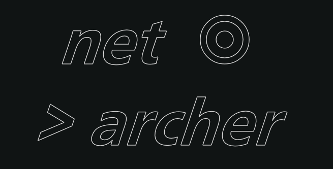

# net archer 🎯

<!-- ## Introduction -->

**net archer** is the one-stop solution to all your network architecture needs. It is designed to help engineers rapidly design, prototype and share interactive(and appealing) network architecture, with ease.

Places to check out: 
- **The live demo at [this link](https://netarcher.vercel.app/).**

- **A lengthy [retrospective devlog](https://github.com/PrateekTh/net-archer/blob/main/README_long.md).**

### Tech Stack

#### Languages

- JavaScript
- Python
- HTML & CSS

#### Frameworks & Libraries

The front end is powered by -
- `React`: Prominent front-end JS framework/library.
- `Reactflow`: Amazing react library for node based workflows.
- `Zustand`: 🐻 Bear necessities for state management in React.
- `Jest`: Testing for React

The backend runs on - 
- `FastAPI`: Modern high-performance web framework for building APIs with Python.
- `Uvicorn`: ASGI web server implementation for Python.
- `Pymongo`: Python distribution containing tools for working with MongoDB.

The database for graphs is a `MongoDB` cluster.

## Setup
In order to run project in a dev environment, follow the following steps:
- Clone this repository
- Navigate to the directory with using Command Prompt or a code editor of your choice.
- Add your MongoDB cluster link as `mongo_client`, in `/backend/vars/var.py` file (create the directory).
    - Visit [MongoDB Cloud](https://www.mongodb.com/products/platform/cloud) to create a profile in case there isn't one.
- Run the desired scripts from the `frontend` and `backend` folders respectively, after installing the dependencies.

#### Frontend
- Navigate to `./frontend`
- Run `npm install` to fetch the dependencies.
    - In case you do not have Node Package Manager installed, download it from [this link](https://nodejs.org/en/download/prebuilt-installer).
- **Run `npm start` to start the local frontend development server.**

#### Backend
- Navigate to `./backend`
- Create a virtual environment [`python3 -m venv env`], and activate it [`env\Scripts\activate`].
- Run `pip install -r requirements.txt` to install the dependencies into the virtual environment
- **Run ` python -m uvicorn main:app --reload` to run the local development server.**

Naturally, both the frontend and backend must be running (in separate terminals) simultaneously, after which all of the app's functionality can be accessed from the frontend. The frontend by itself can provide all export and graphing functionality except the parts involving the database/graph processing.

## Tutorial & Functional Overview

Net Archer follows a simple drag and drop approach to create node based systems, which eventually contain a diverse amount of individual features and (intended) purposes.

The entire entity is referred to as a "graph", which contains a variety of Nodes and Edges, each with their own properties. The entire graph contains certain global key strokes:
- **Delete** an element: `Backspace`/ `Del` keys

#### Toolbar

The toolbar contains a set of draggable buttons, which can be dropped into the editor to create a node. The variety of nodes are committed to fulfilling several different identified use cases, and range from static essentials to highly dynamic and customisable hubs.

#### Nodes
Nodes are the basic building blocks of your graph.

A node, once placed in the editor (by dragging from the toolbar), will contain a set of handles for connections, with certain nodes (discussed individually) containing dynamic handles. It can be dragged, repositioned, deleted and most importantly, connected to other nodes via `edges`. Edges can be dragged out of any handle, and pushed connected to another.

Here is a list of the static nodes with functionalities:

Node | Description
--- | ---------------------------------
Database | Represents a database, with type options and a description.
Client | Represents a client, with source type options and a description
Utility | Represents a custom service/middleware/ etc..
Load Balancer | Represents a Load Balancer
Group | Can be used to group nodes together, will always stay behind all the assigned nodes. Can be assigned any color. ***Note***: *The group node is a still in progress, with parentable features coming soon.*

More dynamic nodes include:
- **Schema Node** : Can be connected as schema/model to a database. Contains a text box input field, where text and handle inputs can be added.
    - In order to add a new handle, (for nested schemas, key relationships, etc..) use the double curly `{{ entity_name }}` brackets to add a new handle, specifying the name of the new property in the braces.
    - **Example**: `{{ coordinates }}`, `{{ user_ids }}`
- **Server Node**: Used to represent servers of any desired type/configuration. Contains a description, as well as an input field to define endpoints and describe them. New handles can be added to either side of the server node, using similar (but not same) commands as the schema node.
    - In order to add a left facing handle for an endpoint, use the `{{\ endpoint_name }}` notation, i.e.simply add a backslash `\` after the opening curly braces.
    - Similarly, for a right facing handle, use the `{{/ endpoint_name }}` notation, i.e. add a forward slash `/` after the opening curly braces.
    - **Examples**
        - `{{\ graph/ }}`: Creates a `graph/` handle on the left side of the node.
        - `{{/ db_access}}`: Creates a `db_access` handle on the right side of the node.

- **Custom Note**: A highly customisable node that contains text.
    - Edit the heading to give it a desired title.
    - Add any custom text/note to the text box.
    - Choose any desired background color for the text box.

#### Edges

Edges form the connections between any given nodes. The prerequisite to creating an edge is the presence two handles, which will act as the source and target for the edge. 

- All edges contain an editable label, posititioned in the middle of an edge. The label supports HTML based markup, and thus the contents and their appearance is highly customisable.

-  On selection, an edge reveals its edge options which contain buttons with the following functions:
    - `Delete`: Delete the selected edge.
    - `Reverse`: Swap the source and target direction for the edge.
    - `Animate`: Create an animated stream of particles from the Source Handle to the Target Handle.
    - `Bidirectional` (`<>`): Mark the edge as bidirectional (for this consideration in upcoming processing functions)

- Edges are **directed** by default, and the **`<>`**, bidirectional option, can be clicked to toggle this property.

#### Functions

On each graph, several functions can be performed. All these are contained in a function pane, which contains individual buttons, for each of the following:

- `Clear`: Completely clear the current graph, and start building a system from scratch.
- `Save`: Save the currently built graph to the database. Once saved, a graph will persist for a minimum of 7 days in the net-archer database for the current build, with this duration being reset based on the most recent use date. **It is recommended to copy the link (via the share menu) to access a graph again, once saved.**
- `Share`: Since the net archer has been built with collaborative and a pro-feedback environment in mind, there are several ways to share a graph, which will show up on clicking the share option:
    - **Copy Link**: Generates a link to access the current graph. This link can be used to access the graph at any time, and once saved for the first time, a user may continue their work on a graph using the same link.
    - **Export Image**: Exports a high-res PNG of the currently visible viewport. This may be used for external presentations, saving, final exports and so on.
    - **Save JSON**: Exports the current graph as a stringified JSON object. While currently the graphs can be only exported to JSONs, this will be used for **loading functionalities**, for **reliable offline work** using net archer.
## Examples

Example graphs are continuously being added to net archer for exploration of use cases:
- [Main Home](https://netarcher.vercel.app/)
